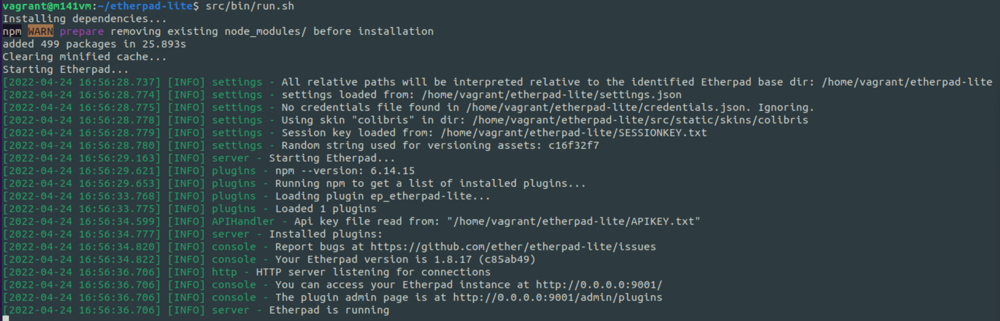
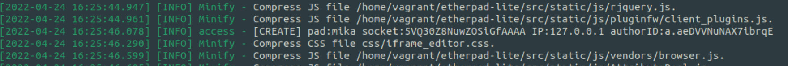

# Beispielapplikation - Etherpad

## Installation

1. NodeJS und NPM installieren:
   
```bash
curl -sL https://deb.nodesource.com/setup_14.x | sudo -E bash -
# Pkaete installieren
sudo apt install -y nodejs
```

2. Git-Repository klonen:
   
```bash
git clone --branch master https://github.com/ether/etherpad-lite.git
cd etherpad-lite
```

3. MySQL-Umgebung einrichten:
   
Datenbank erstellen, User erstellen und berechtigen
```mysql
CREATE DATABASE `etherpad_lite_db`;
CREATE USER '<etherpaduser>'@'localhost' IDENTIFIED BY '<password>';
ALTER USER '<etherpaduser>'@'localhost' IDENTIFIED WITH mysql_native_password BY '<password>';
GRANT CREATE,ALTER,SELECT,INSERT,UPDATE,DELETE ON `etherpad_lite_db`.* TO '<etherpaduser>'@'localhost';
```

4. settings.json:

settings.json.template kopieren
```bash
cp settings.json.template settings.json
```

folgenden Abschnitt einfügen (bzw. einkommentieren) um initiale User zu aktivieren
```json
  "users": {
    "admin": {
      // 1) "password" can be replaced with "hash" if you install ep_hash_auth
      // 2) please note that if password is null, the user will not be created
      "password": "changeme1",
      "is_admin": true
    },
    "user": {
      // 1) "password" can be replaced with "hash" if you install ep_hash_auth
      // 2) please note that if password is null, the user will not be created
      "password": "changeme1",
      "is_admin": false
    }
  },
```

folgende Settings einfügen (bzw. einkommentieren) 
```json
  "dbType" : "mysql",
  "dbSettings" : {
    "user":     "etherpaduser",
    "host":     "localhost",
    "port":     3306,
    "password": "Vagrant1!2",
    "database": "etherpad_lite_db",
    "charset":  "utf8mb4"
  },
```

5. Plugins installieren
   
```bash
npm install --no-save --legacy-peer-deps ep_headings2 ep_markdown ep_comments_page ep_align ep_font_color ep_webrtc ep_embedded_hyperlinks2
```

6. Starten

```bash
src/bin/run.sh
```


7. Test

auf der Weboberfläche wurde ein neues Pad erstellt:
