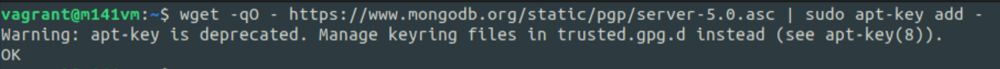
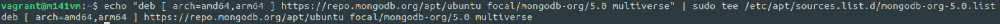

# MongoDB

MongoDB ist ein dokumentenorientiertes NoSQL-Datenbankmanagementsystem.
Es speichert Daten und Strukturen in JSON-ähnlichen Dokumenten (BSON - Binary JSON) ab.
MongoDB ist die weitest verbreitete NoSQL-Datenbank.

gut für unstrukturierte Daten

## Aufbauunterschiede

| RDBMS       | MongoDB                                         |
| ----------- | ----------------------------------------------- |
| Database    | Database                                        |
| Table       | Collection                                      |
| Tuple/Row   | Document                                        |
| column      | Filed                                           |
| Table Join  | Embedded Documents                              |
| Primary Key | Primary Key (von MongoDB automatisch generiert) |

## Installation

### Step by Step

1. Lizenz-Key importieren
   ```bash
   wget -qO - https://www.mongodb.org/static/pgp/server-5.0.asc | sudo apt-key add -
   ```
   out:
   
   1. Falls nicht erfolgreich gnupg installieren
   ```bash
    sudo apt install gnupg
    ```
   1. Lizenz-Key importieren
   ```bash role
    wget -qO - https://www.mongodb.org/static/pgp/server-5.0.asc | sudo apt-key add -
    ```
2. Update-Sourcen erfassen
    ```bash
    echo "deb [ arch=amd64,arm64 ] https://repo.mongodb.org/apt/ubuntu focal/mongodb-org/5.0 multiverse" | sudo tee /etc/apt/sources.list.d/mongodb-org-5.0.list
    ```
    out:
    
3. Sourcen updaten
4. MongoDB installieren


## Authentifizierung

Benutzer erfassen:
```js
use admin
db.createUser({
    user: "mongoAdmin",
    pwd: passwordPrompt(),
    roles:[
        { role: "userAdminAnyDatabase", db: "admin"}
        { role: "readWriteAnyDatabase", db: "admin"}
    ]
})
```

Rollen erfassen
```js
db.createRole({
    role: "roleName",
    privileges: [
        { resource: cluster: {}}
    ]
})
```

## Funktionen

Die MongoDB-Shell interpretiert JavaScript, weshalb es möglich ist, variablen und Funktionen zu definieren.
Im Grunde wäre eine Funktion in MongoDB dasselbe, wie eine Stored Procedure in MySQL.

Diese Funktion erstellt Testdaten in einer "phones" Collection.
```js
populatePhones = function(area, start, stop) {
  for(var i = start; i < stop; i++) {
    var country = 1 + ((Math.random() * 8) << 0);
    var num = (country * 1e10) + (area * 1e7) + i;
    var fullNumber = "+" + country + " " + area + "-" + i;
    db.phones.insert({
      _id: num,
      components: {
        country: country,
        area: area,
        prefix: (i * 1e-4) << 0,
        number: i
      },
      display: fullNumber
    });
    print("Inserted number " + fullNumber);
  }
  print("Done!");
}
```