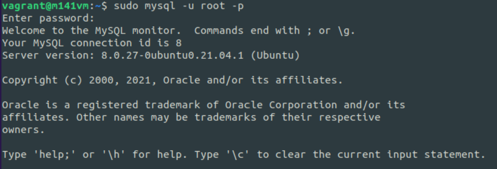
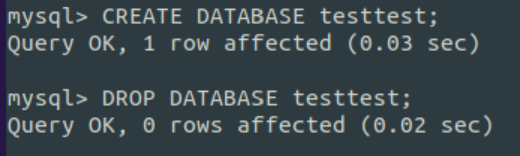

# MySQL

MySQL ist ein weilteit verbreitetes, relationales DBMS. Es ist als Open-Source- sowie als kommerzielle Enterpriseversion verfügbar.

## Installation

Für jede Linux-Version gibt es dazugehörige Software-Versionen.

### Step by Step

Als erstes muss der Paketindex von apt aktualisiert werden.
```bash
sudo apt update
```
Danach kann das Paket mysql-server installiert werden.
```bash
sudo apt install mysql-server
```
Da der neu installierte MySQL-Server noch einige Beispieldaten und praktisch keine Sicherheitseinstellungen hat, wird ein Sicherheitsskript ausgeführt, welches von der MySQL-Installation mitgeliefert wird.
```bash
sudo mysql_secure_installation
```
Das Sicherheitsskript führt durch einige Grundlegende Einstellungen:
- Festlegen einer Passwortrichtliene für DB-Benutzer
- Festlegen eines Root-Passworts
- automatisches Entfernen der Beispieldaten

### Testing der Installation

<!-- tabs:start -->

#### **Status des Diensts:**
```bash
sudo systemctl status mysql
```
out:


#### **Verbindungstest:**
```bash
sudo mysql -u root -p
```
out:


#### **Anzeigen der Datenbanken**
```mysql
SHOW DATABASES;
```
out:


#### **Anzeigen der User**
```mysql
SELECT user, authentication_string, host FROM mysql.user;
```
out:


#### **MySQL-Version**
```mysql
SELECT version();
```
out:


#### **Erstellen und Löschen einer Datenbank**
```mysql
CREATE DATABASE test;
DROP DATABASE test;
```
out:


<!-- tabs:end -->

## Konfiguration

### Datenbank-User erstellen und berechtigen

User mit Passwort erstellen:
```mysql
CREATE USER 'myusername'@'localhost' IDENTIFIED BY 'myuserpassword';
```

Userpasswort ändern:
```mysql
ALTER USER 'myusername'@'localhost' IDENTIFIED BY 'mynewpassword';
```

Sollte ein User auch von ausserhalb des Localhosts Zugriff auf die Datenbank haben, kann statt dem 'localhost' ein '%' gesetzt werden.

User Berechtigen:
```mysql
GRANT SELECT, INSERT, UPDATE, DELETE /*(etc.)*/ ON table.* TO 'myusername'@'localhost';
```

Berechtigungen ansehen:
```mysql
SHOW GRANTS FOR 'myusername'@'localhost';
```

## Storage Engines (oder Database Engine)

Die Storage Engine eines RDBMS ist für die korrekte Ausführung der SQL-Befehle zuständig.
Sie kümmert sich um die CRUD Funktionen sowie die allgemeine Datenbank-Performance.
Wichtig ist, das keine Storage Engine perfekt ist. Alle haben Vor- und Nachteile.

### InnoDB

Die InnoDB Engine ist die am weitesten verbreitete Storage Engine in MySQL. Sie ist auf dem ACID prinzip aufgebaut und unterstützt somit Transaktionen. Ausserdem unterstützt InnoDB die Sperrung einzelner Einträge (row-level locking), was bei vielen aktiven Benutzern die Performance erhöht. InnoDB besitzt eine Crash Recovery und ist die einzige Database Engine, welche Foreign Key Constraints unterstützt.
Für die meisten Fälle ist InnoDB die richtige Engine.

### MyISAM

MyISAM war bis zur MySQL Version 5.5.1 die standard Engine. Sie ist sehr schnell und benötigt weniger Speicherplatz als InnoDB. Jedoch unterstützt MyISAM keien Foreign Keys.

### Sonstige Storage Systems

* Federate: kann eine Datenbank aus mehreren physischen MySQL Servern erzeugen.
* MEMORY: kann tabellen und Einträge im Memory erfassen für mehr Performance
* MERGE: kann logische Gruppierungen von MyISAB Tabellen erzeugen.
* Archive: kann besonders grosse Datenmengen speichern.
* Blackhole: kann Daten entgegennehmen, speichert jedoch nichts und gibt nichts aus.
